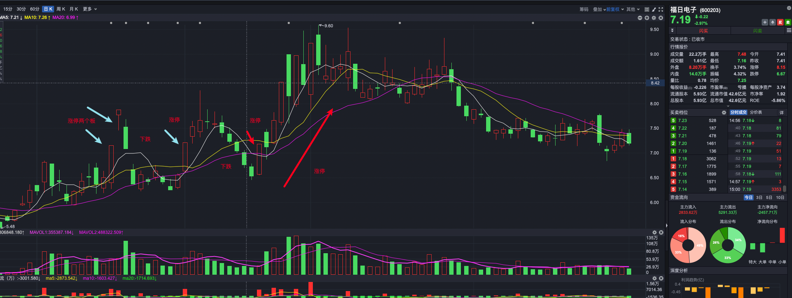
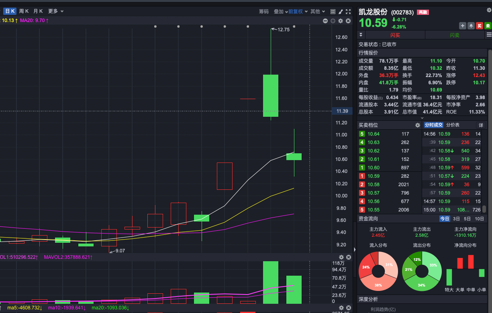
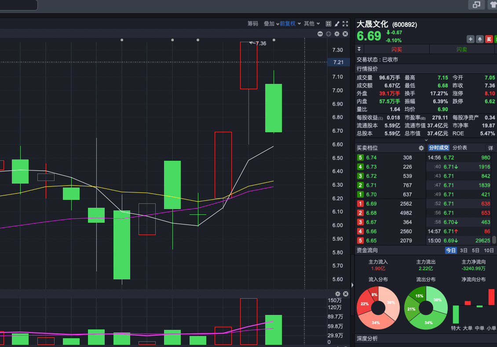
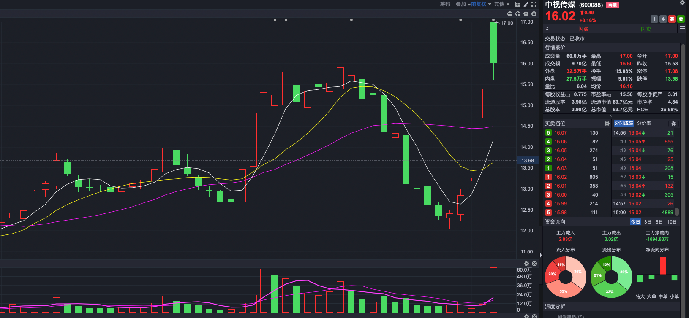
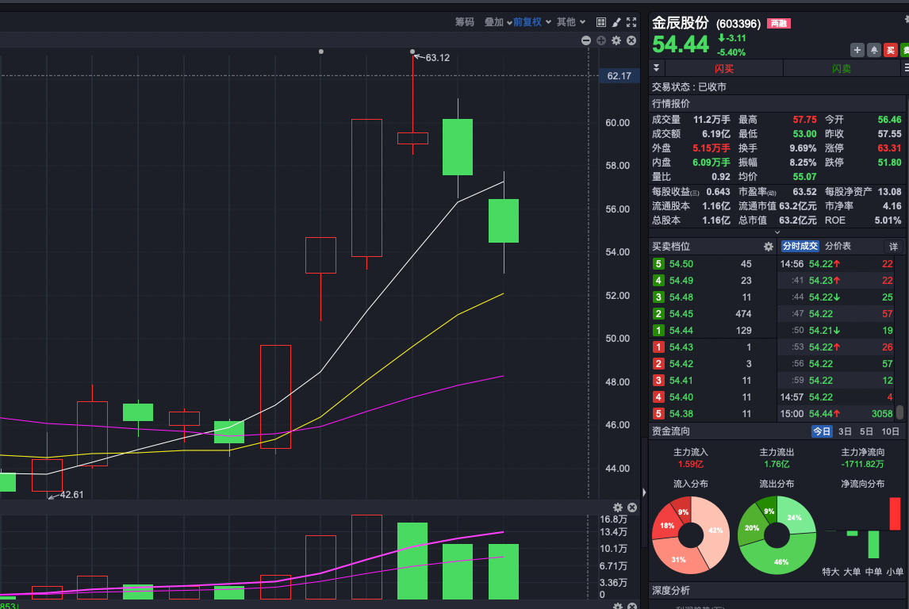

[toc]


# 框架


看图时 不是线越多越好，看三根线即可（5日移动平均，10日移动平均，boll线）

1，底线（boll）26日-2

	当低于布林线且持续时，最长5天，买入，反弹几率大

2，顶线

	当价格高于顶线，且底部量开始低于紫线（10日移动平均）（持续两天）时，将会有持续跌的趋势，需要卖出（最佳时机）

## 规律

	当交易量次日明显高于前日数倍时，有大户介入，他们一般会拉高价格到一个高点，但是这个时候散户买入的少，为了以低成本的价格补仓，整理筹码，他会卖出一部分使股票的价格趋于一个平衡值（大致为（买入价格+拉高价格）/2）
	
	等到价格到达这个价格后，进一步补仓，同时此时也会吸引很多散户进入，保持住股票的价格，以期望下一步的价格走高。
	
	散户在股票上涨的时候买入，等到价格下降的时候会被套牢，下降的比例较小的时候（10%，20%，30%）散户可能会坚持，但是等跌幅较大，散户会抛出股票，这个时候市场上会有许多富余的股票，且价格较低，大户可以在这个时候补仓。
	
	股票会呈现一种交易量次日比前日多出数倍，可能持续几日（可能最多三天），此为大户介入的征兆。价格会极速拉高，到一个高位，同时吸引散户进入（散户的资金实力不可小觑）。大户可能资金用尽了才到达一个小高峰，为了进一步拉高股价，会卖出一部分，图像表现为低位震荡，此时散户进来，坐大了基本盘，再次购入一部分的股票，稳定股票的价格，再次大量买入，拉高股价，由于基本盘的扩大，此时的股价可以在冲高峰。呈现一个向上的M形走势。

## 一个原则

	跌幅（70%以上）基本盘小（100亿一下/100-200亿）量大

## 选板块

	可以参考板块排名，根据排名来选板块，同时要有全局意识

思考各个板块之间的联系，找出深层次的原因

一个板块最少20个个股以上

## 选个股

	从板块之间选个股

个股选购原则

1. 与历史最高价格跌幅大，
2. 基本盘小，
3. 交易量大


# 1月28日复盘

## 龙回头

### 恒润股份


- 今日已经回踩5日均线
- 前日的最低点 23.31为止损点
- 止盈点是·33.85

### 龙高股份


- 处于龙抬头的观察期限，还没有跌破40% 放入自选股

### 清源股份


- 有龙抬头的趋势
- 大概率回调

### 惠发食品


``` 
- 后期有龙抬头的趋势
```


## 龙抬头的疑问

### 恒银科技

银行。证券 黄金 油

光伏 周二 3天， 回调 强势 回调

3个板。。放量 

2-3板。下跌


- 这个恒银科技前期有个5次涨停，后期下跌之后又有两个涨停（勉强算7个吧）

但是后期的两个涨停 没有之前的高。这个算龙回头吗？

## 第一种战法

### 中科云网


<hr>


```
- 12月21日 两次涨停
- 12月21日有放量
- 下跌
- 涨停
```

后期可能`下跌`需要后期观察

- 如果后期下跌，且再次涨停
- 是第一种战法的信号
- 等下跌之后 ，回踩5日线的时候购入

量比

## 放量行业


- 观察今日的量比，光伏设备，能源金属，风电设备，电池，贵金属这些是放量的行业
- 这些行业偏向于新材料


## 缩量行业

- 受国家政策的影响，游戏行业，文化传媒在缩量


## 大盘情况


- 今日大盘触底反弹了
- 交易量已经突破了10日均量线

龙回头 不好用了

光伏 变快 fhk


放量 没有涨起来的


风电 好的


# 1月29日复盘

## 今天的行业板块

- 石油行业，农牧饲渔，通信服务 ，依然坚挺
- 光学光电子，食品饮料，证券今日刚刚进入涨幅前十
  - 光学中有亚世光电已经连续涨停，带着光学板块的其他股票也有涨幅
  - 光板块大部分股票都在涨

- 食品饮料，今日突然上来的


- 公用事业昨天涨幅大，今日降幅最大，可见昨日国家队下场
- 昨日光伏设备，能源金属，航天航空，电池，化肥行业均由排名靠前，下降

### 西陇科学


- 今天有量 西龙今日达到了33.33% 后期可能下降

### 华映科技


- 龙回头：华映科技已经涨到了33.33%，且有量，后期可能下跌

### 三柏硕


- 突破33% ，龙回头： 已经开始下降了

### 捷荣技术


龙回头 捷荣已经出现疲态，今日量不足

- 昨日突破75%后 今日开始下降

  

## 后期可能龙回头

### 龙韵股份


- 今日量十分少

- 说明虽然价格下跌但流出的少

- 后期可能跌

  

### 亚世光电


- 后期龙回头可能

## 龙回头突破

### 龙洲股份


龙洲股份此前的龙抬头已经超过之前的点位，达到8.55 

- 龙抬头位置需要重新计算

  <hr>


### 天威视讯


今天 天威视讯涨到了18.48，龙回头需要从18.48的高点重新计算

## 后期可能龙回头

### 清源股份


- 5日连板-后期龙抬头

  

### 惠发食品


## 小龙回头

### 莎普爱思


- 莎普爱思 此前5日连板 目前已经突破33.3%
- 后期可能会下跌

### 欧菲光


- 目前欧菲光刚刚站上5日均线
- 明日可能回涨
- 止损位 8.10
- 止盈位 9.51
- 观察明日开盘 可以买入

###  伟时电子


- 今天刚刚站上5日均线
- 还没有突破33%
- 止损点 22.84
- 止盈点 26.85
- 观察明日开票 5日开在5日均线附近可入

## 已经龙回头

## 食品

### 莲花健康


- 这个龙回头已经站上5日均线 晚了

## 证券领涨


可以等低于5日均线的时候入

# 1月2日复盘

### 亚世光电


- 今日量没有超过10日均线，9个版 今日没有量，后期可能下跌
- - 

### 清源股份


- 标准龙回头

### 海源复材

```
- 最高价 35.76
- 最低价 4.74
- 流值 32.14亿
```


- 前两日涨停
- 今日下跌
- 有第一种战法的味道
- 买入点 在下一次涨停 -下跌 -涨停 -下跌后跌破5日线，又重新踩上5日线的前一线最低价-2分

## 小龙回头

### 豪美新材


```
- 6个板
- 降低有量
- 刚刚踩上5日均线
- 止损点 是上个交易日最低价 23.37-0.02=23.35
- 止盈点 27.87
```

## 第一种战法

### 亿道信息


- 已经涨上去了

### 白云电器


``` 
-失败点操作
- 跌破20日线了
```

### 福日电子



- 典型的第一种战法

### 中科云网


- 最高价 12.45

- 最低价 2.14

- 流值 43.8

  ```
  继续观察，后期可能下降
  ```

  

## 行业


## 行业涨幅

- 煤炭

- 航运

- 电力

- 环保

- 公用

- 中药

- 医药

  ```
  这些是国家拉升股市，不重要
  
  ```

## 行业跌幅


- 电池

- 光伏

- 风电

- 能源金属

  ```
  重点观察，可能是买入点
  ```

  ### 时代万恒

  

``第一种战法``

## 1月3日复盘


```
今日大盘调整，下跌，没有超过10日均量线
```

### 欧菲光


```
- 昨日跌破5日均线,今日又站上5日均线,可以入
```

`止损价`

- 4.16 {跌破5日均线的最低价-0.02}

`止盈价`

- 9.51 {33.3%}

### 中科云网


```
- 目前跌破5日均线,止损价 4.96-0.02=4.94
- 有放量
```

- 观察明日,是否站上5日均线,站上是买入时机

### 智微智能


- 等待跌破5日线

### 佳龙股份


```
- 最高 11.05
- 最低 1.28
目前 3.46
流值 32.4
```


- `止损点` 3.20{今日站上5日均线}
- `止盈点` 再次跌破5日均线

### 闽发铝业


- 等待跌破5日均线

### 龙州股份


- `止损点` 今日最低价 -0.02 7.72元
- `止盈点` 下次跌破5日均线

### 凯龙股份



- 已经跌破 ,等待再次站上

### 五方光电


- 等待再次站上5日均线

### 瑞玛精密


- 等待跌破

### 领湃科技


## 量比


# 1月4日复盘

### 云煤能源


- 最高价 11.26

- 最低价 1.42

- 目前 5.68

  `等待跌破5日线`

  ## 大晟文化

  

```
最高价 - 8.85
最低价 -2.49
跌幅- 71.86
```

- 流值 37.4亿元

### 沈阳化工

```
- 最高价 14.34
- 最低价 1.4
- 目前 4.78
```


### 中视传媒

```
 最高价 44.21
 最低价 2.98
 目前 16.02
```



- 未在20日均线上,不算强势
- 今日下跌有量

### 佳隆股份


- 今日量不足
- 止损点 今日最低价3.31-0.02 3.29

### 瑞玛精密


- 等待再次站上5日均线

## 大盘


- 大盘接触boll线中线,跌


# 1月5日复盘

## 大盘情况


- 今日大盘继续下跌

## 行业板块


- 今日,光伏设备涨上来了,但是风电设备没有涨上来
- 银行 煤炭 铁路 房地产电力  钢铁在领涨


-  跌破布林带时的,光学光电子 风电设备 依然下跌

## 个股

### 金辰股份



- 最高价 200
- 最低价 15
- 目前跌破5日均线,等待站上

### 宝塔实业


- 最高价 12.77
- 最低价 0.61

### 神雾节能

- 最高价 44.98
- 最低价 0.8


- 等待跌破

### 沈阳化工


- 等待重新站上

### 海源复材


- 止损价 前一天最低价 12.13减去2分
